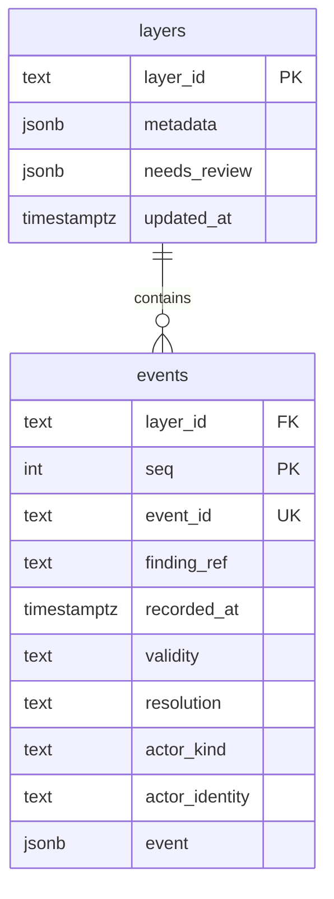

# Data model

**Proposal — not implemented.** Normalized schema for `LAAS_BACKEND_TYPE=db`,
replacing the single JSON-blob `layers` table in `traust_ledger/backends/db.py`.

Additional indexes (not expressible in the diagram above): `events (layer_id, finding_ref)`,
`events (layer_id, recorded_at)`.

`events.layer_id → layers.layer_id`, `ON DELETE RESTRICT`.
